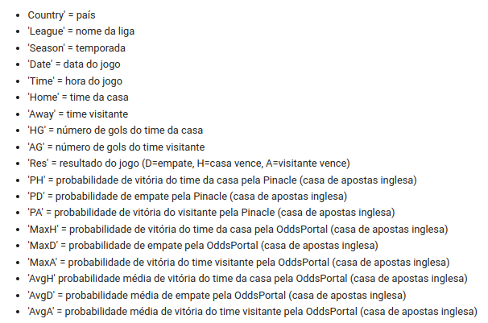
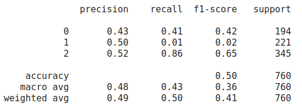

# Previsão do Campeonato Brasileiro
Algoritmo desenvolvido em Python com o auxilio do Google Colab para previsão dos jogos do Campeonato Brasileiro.

O arquivo CSV utilizado para as previsões encontra-se disponível em:
fonte: [https://www.football-data.co.uk/](https://www.football-data.co.uk/)

São utilizados os jogos entre 2012 e 2019 para os testes e os jogos de 2020 e 2021 para as previsões.

A escolha do algoritmo é feita com auxilio de tuning dos valores através do GridSearch.

## Pacotes necessários

* pandas
* numpy
* sklearn
* yellowbrick

## Legenda do DataFrame

	

## Matriz de confusão

	

## Acurácia

	

## Conclusões

Observamos que o melhor algoritmo tem 86 % de chance de identificar uma vitória em casa, porém com uma precisão de apenas 52 %, então, não é aconselhável o uso desse algoritmo para previsao de jogos do campeonato brasileiro.
